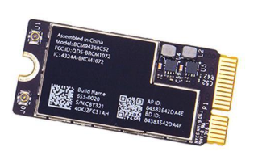

# DeskMini Hackintosh
This is the hackintosh for the deskmini 310


## SPECS

+ OS: macOS 11.2.3 20D91 x86_64 / (SMBIOS: iMac19,1)
+ OpenCore: 0.6.7
+ CPU: Intel i9-9900T (8c16t ES) @ 1.7GHz
+ GPU: Intel UHD Graphics 630
+ Wi-Fi: BCM94360CS2
+ SSD: 512GB [TOSHIBA RC500 NVMe](https://union-click.jd.com/jdc?e=&p=AyIGZRprFQMTBlQeUxMEGwFdKx9KWkxYZUIeUENQDEsFA1BWThgJBABAHUBZCQUdRUFGGRJDD1MdQlUQQwVKDFRXFk8jQA4SBlQaWhAKFAFcHVMlVHdgM2koUgd3UTdBP3ZiZHoLGg0TYh4LZRprFQMTB1MeXxwGEjdlG1wlVHwHVBpaFAMTBVYSaxQyEgNcHlsdARYAURxYFzIVB1wrWxwBFQRWHV8VBhFpFCtrJQEiN2UbaxYyUGkHTAkdUBYHARhfRlIXUlBMC0AKRg9cE1oVVhUEB0kLQTIQBlQfUg%3D%3D)
+ RAM: 8GB x 2 [ADATA DDR4 2400](https://union-click.jd.com/jdc?e=&p=AyIGZRteEgYSAVEcWRQyEARSGV0RAxAFVR5rUV1KWQorAlBHU0VeBUVNR0ZbSkdETlcNVQtHRVNSUVNLXANBRA1XB14DS10cQQVYD21XHgVWHFkTBhMFVxteJUZOXRUcBEFXcl8NXxNSHBsHMEIPUnIeC2UaaxUDEwdTHl8cBhI3ZRtcJUN8B1QaWBEEEwFlGmsVBhUOVBhYFQoRAF0SaxICGzdVElgSAREBURtfFmxTN2UrWCUyIgdlGGtXbEdXBh5fQgEaAlJLDBAEFQ9cGAlFBkEPVUsMFQFCAldLaxcDEwNc)
+ Monitor: [DELL U2518D](https://union-click.jd.com/jdc?e=&p=AyIGZRtaHAAaAFUdWh0yEQZdHVoTAhsCVRhrUV1KWQorAlBHU0VeBUVNR0ZbSkdETlcNVQtHRVNSUVNLXANBRA1XB14DS10cQQVYD21XHgRUE10UBBIOUBtYJV1KRgVPGRwHcEQraAlXQE9%2FIWs9ZmIeC2UaaxUDEwdTHl8cBhI3ZRtcJUN8AVYfWhIFIgZlG18TABIPVRpTEAsQBWUcWxwyEg5WHFgWBBYHURg1VDIiN1YrayUCIgRlWTVHVxQDB0lTHAMUDlYeUhECG1IGGAkcARZTVR1dHQcSAmUZWhQGGw%3D%3D)

## TELEGRAM
Please join Telegram [Join Telegram](https://t.me/hackintash), if you have any questions

## Wi-Fi CARD
My Wi-Fi card is BCM94360CS2, you need to get a NGFF card like this one. TOSHIBA RC500 NVMe SSD don't have any nand in the back, so it's very nice to have.




## BIOS

Load UEFI Defaults

+ Advanced > Chipset Configuration  > Onboard HD Audio & Onboard HDMI HD Audio: Enabled
+ Advanced > Chipset Configuration  > VT-d: Disabled
+ Advanced > USB Configuration > XHCI Hand-off: Enabled
+ Advanced > CPU Configuration  > C States Support: Disabled
+ Advanced > Super IO Configuration > Serial Port: Disabled
+ Security > Secure Boot: Disabled
+ BOOT > CSM: Enabled


## Donating 💸

- Feel free to [Buy Me a Coffee](https://www.buymeacoffee.com/csrutil)
- `XMR 4APxe9PpCgw2RdZjkiBqVk6mdyforWiQvGHGCXp6iWojTZaqmfuKcAgBEXTkshDLwo6zGu5yNVUBriyVuUV8jUr58nnkexR`

## CINEBENCH


## macOS Tips

```
# https://gist.github.com/csrutil/b2cce932dda8b226f37be2880215aee6
sudo pmset -c sleep 30
sudo pmset -c displaysleep 30
sudo pmset -c disksleep 30
sudo pmset -c hibernatemode 0
sudo pmset -c standby 0
sudo pmset -c autopoweroff 0
sudo pmset -c tcpkeepalive 1

# disable the Spotlight indexes
sudo mdutil -a -i off

# change host name
sudo scutil --set HostName mini
sudo scutil --set ComputerName mini
sudo scutil --set LocalHostName mini

sudo spctl --master-disable
```

## CREDITS
+ [acidanthera](https://github.com/acidanthera/OpenCorePkg)
+ [xjn819 blog](https://blog.xjn819.com/?p=7)
